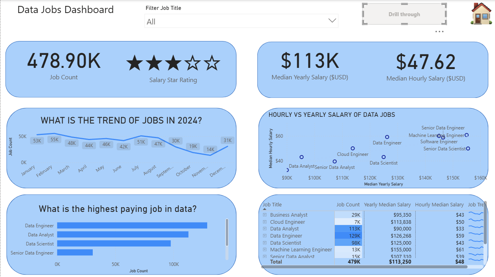
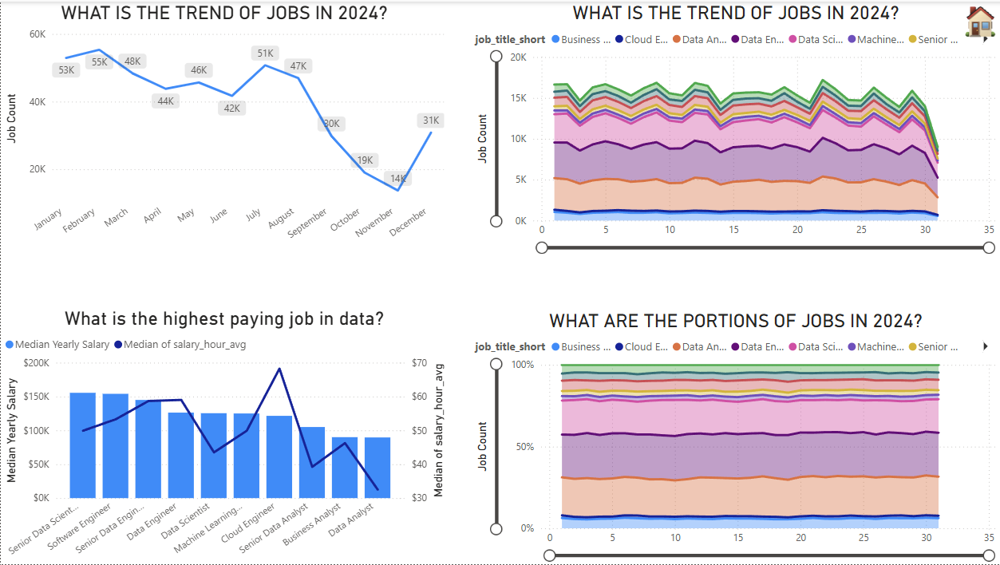
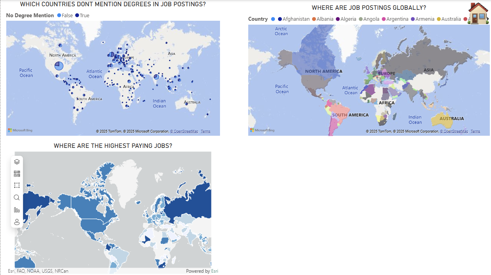
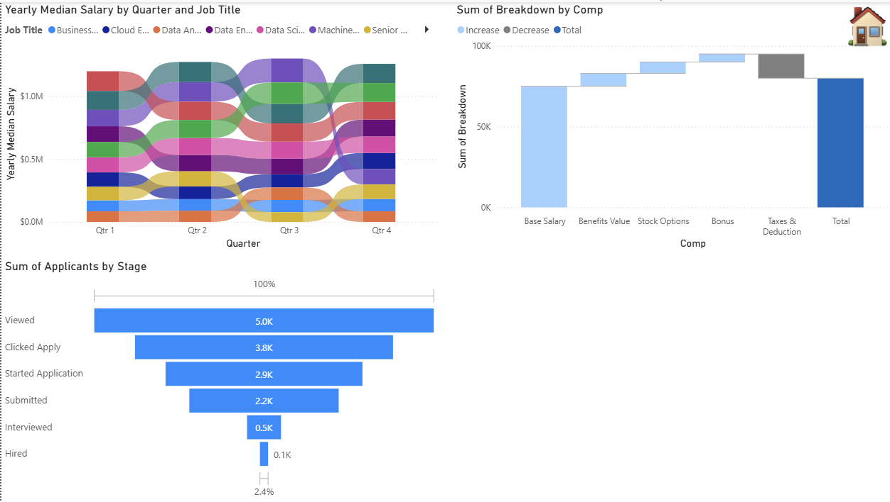
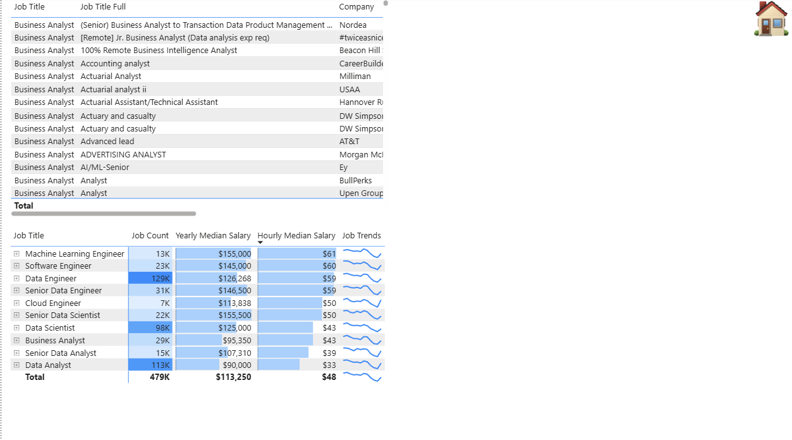
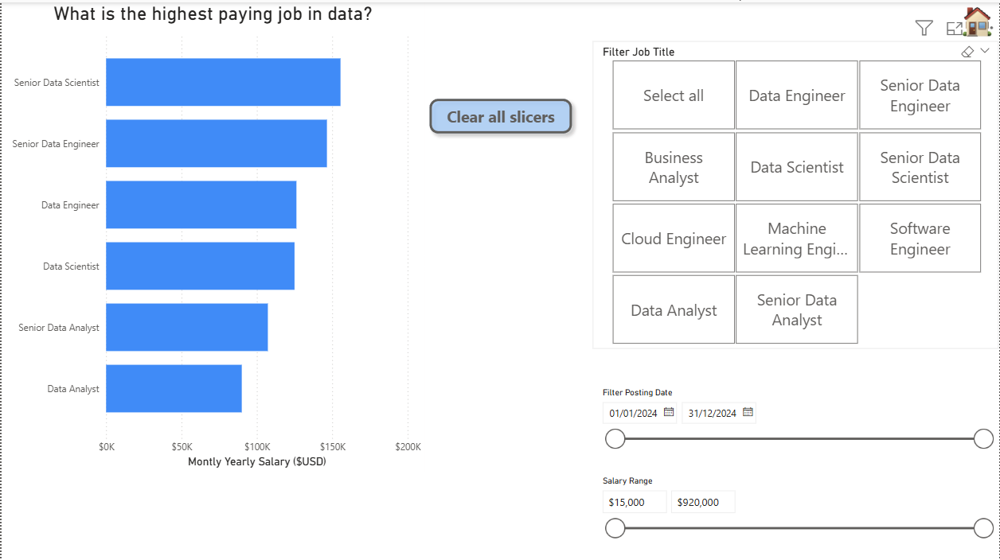

# Power BI Visualizations 📊

This folder contains **screenshots of all visualizations** created during my Power BI learning journey using the **Data Jobs dataset**.  
These images provide a visual reference for each report tab and demonstrate different chart types, dashboards, and interactivity features.

---

### Main Dashboard

The main dashboard combines insights from all tabs into a single interactive view.

### Drill-Through View
Drill-through pages provide deeper insights into selected metrics.

---

## Home Tab
Landing page with buttons for navigating across report pages.

---

## Column & Bar Charts
Visualizations of vertical, horizontal, and stacked bar/column charts.

---

## Line & Area Charts
Line charts, area charts, and combo charts for trend analysis.

---

## Common Charts
Standard visuals including pie charts, donut charts, and clustered charts.

---

## Map Charts
Filled maps, bubble maps, and geospatial visualizations.

---

## Uncommon Charts
Funnel charts, waterfall charts, scatter plots, and other less common visuals.

---

## Tables
Matrix tables with conditional formatting and tabular insights.

---

## Cards
Single-number KPIs and multi-row cards.

---

## Slicers
Filters, dropdowns, and advanced slicer interactions for dynamic reporting.

---

## How to Use
1. Open the `report.pbix` file from the root repository in **Power BI Desktop**.  
2. Navigate through tabs using the Home page buttons.  
3. Refer to these screenshots for a **quick visual overview** of the dashboards and charts.  

---

## Notes
- Screenshots are included for reference; interactivity requires Power BI Desktop.  
- File names correspond to the tabs and visual types for clarity.  
